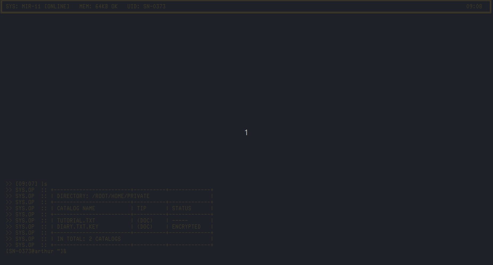
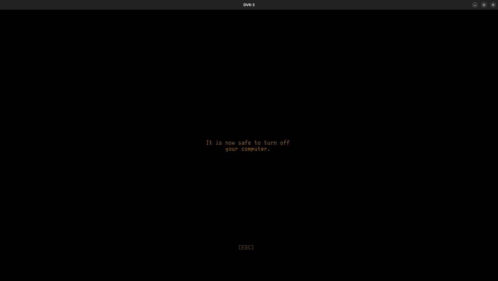
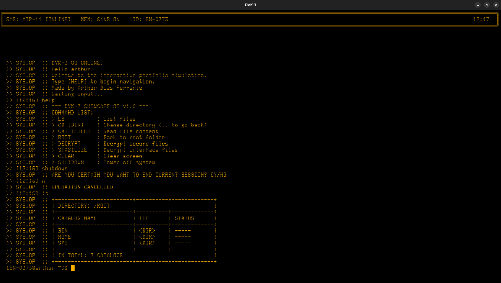
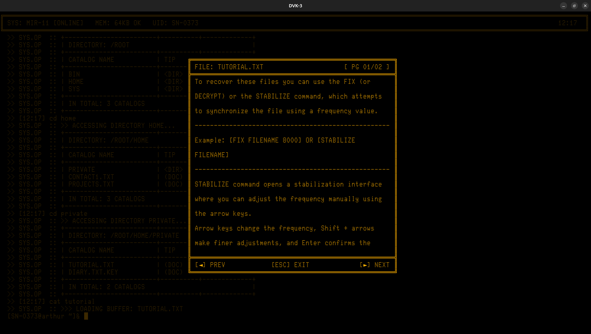

# DVK-3 Bunker

A Java terminal simulator inspired by the historic Soviet **DVK-3** computer (Диалоговый Вычислительный Комплекс). Demo environment with a virtual file system, boot sequence, and file decryption.
========


> **Note:** This is a creative reinterpretation inspired by the DVK-3. It is not an accurate hardware or software emulation.


---


## Features


- **Virtual file system** — Navigate directories (ROOT, BIN, HOME, SYS, PRIVATE) with styled listing
- **Terminal UI** — Built with [Lanterna](https://github.com/mabe02/lanterna) and a retro font (Glass TTY VT220)
- **Boot sequence** — ROM BIOS–style startup with Russian messages and memory tests
- **Encryption simulation** — “Protected” files with layers (SAFE) and a `DECRYPT` command to “stabilize” and read them
- **Classic commands** — `LS`, `CD`, `CAT`, `CLEAR`, `SHUTDOWN`, `HELP`, plus shortcuts like `ROOT` and `CHECK`


---


## Screenshots
Some interface snapshots from the simulator: PNG prints and a short GIF.

See how `STABILIZE` behaves in practice:






---

## Requirements


- **Java 17+**
- **Maven 3.6+** (for build and tests)
- Dependencies are managed by Maven: **Lanterna** (runtime), **JUnit 5** (tests)


---


## How to run


### From the command line (Maven)

1. Clone the repo and open a terminal in the project folder:
   ```bash
   cd "DVK-3 snippet/Dvk-3 snippet"
   ```

2. **Run the application:**
   ```bash
   mvn compile exec:java -Dexec.mainClass="core_logic.Main"
   ```
   *(If you add the `exec-maven-plugin` with `mainClass` in `pom.xml`, you can use `mvn exec:java`.)*

3. **Run tests:**
   ```bash
   mvn test
   ```

### From the IDE

1. Open the **`Dvk-3 snippet`** folder as a Maven project (IntelliJ: *File → Open* and select the folder containing `pom.xml`).
2. Run the main class: **`core_logic.Main`**.
3. To run tests: right‑click `src/test/java` or a test class → *Run Tests* (or use the Maven tool window → *Lifecycle → test*).

The terminal window will open with the boot sequence; then you can type commands.


---


## Testing


The project uses **JUnit 5** for unit tests. Tests live under `src/test/java`, mirroring the main package structure.

- **`CryptoUtilsTest`** — Asserts that `safeAlgorithm` returns the same text when frequency matches, and corrupted text when it does not.
- **`Dvk3TaskManagerTest`** — Asserts that tasks are added/removed correctly (e.g. `killTaskByName`).
- **`VirtualFolderTest`** — Covers `VirtualFolder.getFileByName` / `getFolderByName` behavior, including lookup that ignores case and treats **`\` as a space** in names (so `MY\FILE` matches a file like `MY FILE.TXT`).

Run all tests:

```bash
mvn test
```


---


## Available commands


| Command         | Description                                       |
|-----------------|---------------------------------------------------|
| `LS` / `DIR`    | List files and folders in the current directory   |
| `CD [DIR]`      | Enter a directory (use `CD ..` to go back)        |
| `ROOT` / `/`    | Go to the root directory                          |
| `CAT [FILE]`    | Read a text file's contents                       |
| `DECRYPT ...`   | Decrypt protected files (see `HELP` for syntax)   |
| `STABILIZE ...` | Stabilize protected files (see `HELP` for syntax) |
| `CHECK [FILE]`  | Check a file's “frequency” (used with DECRYPT)     |
| `CLEAR`         | Clear the screen                                  |
| `HELP` / `?`    | List commands                                     |
| `SHUTDOWN`      | End the session                                   |


**Tip:** Go to the `HOME` folder for contacts and projects; in `HOME/PRIVATE` there are files that require `DECRYPT`.

### File names with spaces

The virtual file system stores some names with spaces (for example `MY FILE.TXT`). When you type a command, **a single space often splits arguments**, so the parser may not see the full name.

**Use a backslash `\` as a stand-in for a space** in file (and folder) names when you need to refer to them in commands:

- File on disk: `MY FILE.TXT`
- You can type: `CAT MY\FILE` or `CAT MY\FILE.TXT` (same idea for `CD`, `CHECK`, `DECRYPT`, etc.)

Under the hood, `VirtualFolder` normalizes `\` to a space before matching names, so `MY\FILE` resolves like `MY FILE` for lookup.


---


## Project structure (overview)


```
Dvk-3 snippet/
├── pom.xml
├── src/main/java/core_logic/
│   ├── Main.java                 # Entry point, Lanterna terminal and font
│   ├── controller/               # GameController, ProcessCommands
│   ├── models/                   # System, filesystem, crypto, rules
│   │   ├── filesystem/           # VirtualFile, VirtualFolder, Dvk3FileManager
│   │   ├── system/               # Dvk3System, Logger, TaskManager, DocReader
│   │   ├── physical/             # Dvk3Core
│   │   └── utils/                # CryptoUtils, SignalVisualizer
│   └── views/                    # BootSequence, TerminalViewer, DocumentWindowViewer
├── src/main/resources/
│   ├── Glass_TTY_VT220.ttf       # Retro terminal font
│   └── data/                     # readme.txt, contacts, secret.txt, tutorial, etc.
└── src/test/java/core_logic/
    ├── models/utils/             # CryptoUtilsTest
    ├── models/system/            # Dvk3TaskManagerTest
    └── models/filesystem/        # VirtualFolderTest
```


---


## License and credits


© 2026 Arthur Dias Ferrante. All rights reserved.
=======
Unauthorized distribution or reverse engineering of the DVK-3 kernel simulator logic is strictly prohibited.


---


*DVK-3 Bunker — a trip to a terminal inspired by the DVK-3.*
